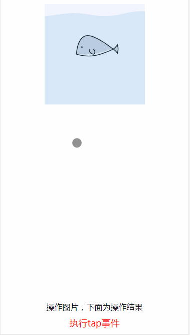
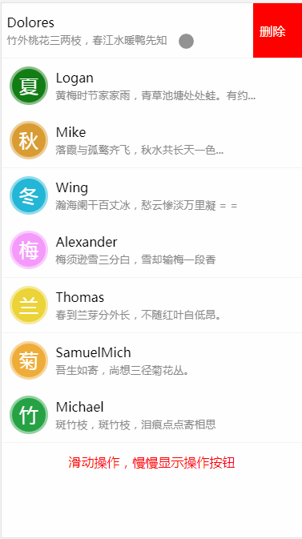

# 移动端手势库

## 简介

一个轻量的移动端javascript手势库。

**兼容性：**

+ Android 5.0+
+ iOS 7.0+

**实现思路与方案**

你可以参看文章[《一步步打造一个移动端手势库》](https://juejin.im/post/5a795e6d6fb9a0635630fe2b)
如果以上文章无法打开，你可以[点击这里查看](https://github.com/prianyu/juejinArticle/tree/master/gesture)

文章旨在提供一种实现移动手势库的思路，该项目即对文中思路的完整的实现。如果感兴趣，你可以fork本项目后进行完善

## 支持的手势

+ ``touch:`` 原生的touchstart事件
+ ``move:`` 原生的touchmove事件
+ ``end:`` 原生的touchend事件
+ ``cancel:`` 原生的touchcancel事件
+ ``multitouch:`` 多个手指触摸事件
+ ``tap:`` 单击事件，如果发生了双击则不会执行该事件
+ ``longtap:`` 长按事件
+ ``dbtap:`` 双击事件
+ ``multimove:`` 多个手指滑动事件
+ ``slide:`` 滑动事件
+ ``swipe/swipeLeft/swipeRight/swipeUp/swipeDown:`` 划动手势，滑动后手指离开触发
+ ``pinch:`` 缩放手势
+ ``rotate:`` 旋转手势
+ ``finish:`` 执行完以上事件后执行的事件


## 使用方法

### 1. 安装

**方法一、使用script标签引入**

**（1） 引入`dist/nice-gesture.js`或者`dist/nice-gesture.min.js`文件，支持amd和cmd规范，如**

```html
  <script src="./dist/gesture.js"></script>
```

**（2）使用npm**

```shell
npm install --save nice-gesture
```
```javascript
import Gesture from 'nice-gesture'
```

**2. 实例化并绑定事件**

```javascript

var ges = new Gesture("#img").on("tap",function(){
  console.log("执行了tap操作");
}).on("dbtap",function(){
  console.log("执行了双击操作")
});
ges.on("longtap",function(e,params){
  console.log("执行了longtap操作");
  console.log(e,params);
})

```

## 属性、方法和API

#### 1. 构造函数`Gesture(target[,selector])`

+ `target` : 需要绑定事件的dom对象，可传入符合`querySelector`的选择器或者dom元素

+ `selector`: 可选，触发事件的子元素，用于事件委托，如target = ul，selector = li,仅支持传入选择器

#### 2. 事件回调函数

所有的触发的事件回调函数均接受两个参数`(e, metas)`

+ `e`: 原生的event事件对象，可以通过e.target等进行原生的操作

+ `metas`: 每次手指触碰开始，触发各个事件时引起各个数据变化，分别如下：

 	+ `deltaX`: 触摸和移动时手指每次变化的横坐标

 	+ `deltaY`: 触摸和移动时手指每次变化的纵坐标

 	+ `diffX`: 触摸和移动时，相对开始触摸时的横坐标

 	+ `diffY`: 触摸和移动时，相对开始触摸时的纵坐标

 	+ `angle`: 触摸和移动时，旋转的角度

 	+  `zoom`: 触摸和移动时，缩放的倍数

 	+ `direction`: 划动的方向，值为`up/down/left/right`中的一个

#### 3. API

 + `on(type, callback)`: 事件的绑定，支持链式调用和多次绑定,如：

 ```javascript
var ges = new GT("#tareget");
function handleTap = function(e) {
	console.log('tap has happended');
	console.log(e);
}
 ges.on("tap", handleTap)
    .on("tap",function(e,params){})
    .on("swipe",function(e,params){});

 ```

+ `off(type[,callback])`: 卸载对应事件的处理函数，如`ges.off("tap", handleTap)`将卸载tap事件的处理，不传第二个参数将卸载掉当前事件的所有回调

+ `destroy`: 销毁对象，`ges.destroy()`

+ `setOptions(obj)`: 设置参数，目前仅接受`longtapTime`和`distance`两个参数,支持链式调用,如：


 ```javascript
 ges.set({
  distance: 40,//手指滑动后离开屏幕，当滑动的距离超过40px时才会触发swipe手势
  longtapTime: 750 //手指按住750ms后才会触发longtap事件
 }).on("longtap",function(){
  console.log("执行了长按事件")
 })

 ```

 ## 例子

 **1. 综合实例**

 html代码：

 ```html

<div class="container">
  
</div>
<div class="text-wrap">
  <p>操作图片，下面为操作结果</p>
  <p id="text" class="red"></p>
</div>

 ```
> javascript代码(引用了[transform.js](http://alloyteam.github.io/AlloyTouch/transformjs/))：

```javascript

var el = document.getElementById('img');
var p = document.getElementById("text");
var initscale = 1;
Transform(el);
function text(str) {
  p.innerHTML = str;
}
new Gesture(el).on('tap',function(){
  text('执行tap事件')
}).on('touch',function(){
  initscale = el.scaleX;
}).on('dbtap',function(){
  (el.scaleX == 2) && (el.scaleX = el.scaleY =  1) || (el.scaleX = el.scaleY  =2);
  text('double tap事件')
}).on("longtap",function(){
  text('执行longtap事件')
}).on('slide',function(params,e){
  el.translateX += params.deltaX;
  el.translateY += params.deltaY;
  e.preventDefault()
}).on('swipeUp',function(params){
  text('swipeUp')
}).on('swipeDown',function(params){
  text('swipeDown')
}).on('swipeLeft',function(params){
  text('swipeLeft')
}).on('swipeRight',function(params){
  text('swipeRight')
}).on('rotate',function(params){
  el.rotateZ += params.angle;
}).on('pinch',function(params){
  el.scaleX = el.scaleY = initscale *params.zoom;
})

```

效果如下：



缩放和旋转效果请扫描以下二维码在手机查看


**2.聊天列表**


通常在一些数据列表，如地址库，聊天列表，会有一些左滑删除等操作，结合该手势库也是可以轻松实现。

html代码：

```html
<div class="container">
  <ul id="list">
    <li id="li0">
      <div class="info">
        <div class="avatar" style="background-color:#3cea40;">春</div>
        <div class="mess">
          <p>Dolores</p>
          <p><small>竹外桃花三两枝，春江水暖鸭先知</small></p>
        </div>
      </div>
      <div class="ctrl">
        <div class="del" onclick="remove(0)">
          <span>删除</span>
        </div>
      </div>
    </li>
    <!-- 这里有更多的列表 -->
  </ul>
  <div id="text"></div>
</div>

```

> CSS代码可查看通过源码查看，此处不做讲解。


javascript代码:

```javascript
var textNode = document.getElementById('text');
var list = document.getElementById("list");
function fillText(str) {
  textNode.innerHTML = str;
}
function remove(index) {
  list.removeChild(document.getElementById('li'+index));
}
lis = list.querySelectorAll('.info');
for(var i = 0, len = lis.length; i < len; i++){
  Transform(lis[i]);//transform实例化
  lis[i].redirect = true;//标记tap时是否跳转
}
//使用事件委托实例化手势
new Gesture("#list",'.info').on('touch',function(e,params){
  var target = params.selector;
  //触摸时所有的列表项恢复初始状态
  for(var i = 0, len = lis.length; i < len; i++){
    lis[i].translateX = 0;
  }
}).on('tap',function(e,params){
  var target = params.selector;
  if(target.redirect) {
    fillText('单击操作，准备跳转到详情窗口');
  } else {
    fillText("单击操作，恢复列表状态");
    target.translateX = 0;
  }
}).on('slide',  function(e,params) {
  var target = params.selector;
  var offset = target.translateX + params.deltaX;
  target.translateX = Math.min(0,Math.max(-68,offset));
  e.preventDefault()
  fillText("滑动操作，慢慢显示操作按钮");
}).on('swipeLeft',function(e,params){
  var target = params.selector;
  target.translateX = params.diffX < -30 ? -68 : 0;
  fillText("左划动操作");
}).on('finish',function(e,params){
  //执行结束后判断平移的距离，小于30恢复，大于等于30则展开操作按钮
  var target = params.selector;
  if(target.translateX < -30){
    target.translateX = -68;
    target.redirect = false;
  } else {
    target.translateX = 0;
    target.redirect = true;
  }
}).on("longtap",function(e,params){
  //longtap主要为安卓用户的操作习惯
  var target = params.selector;
  target.translateX = -68;
  fillText("长按操作，直接显示操作按钮");
});

```


效果如下：




可以扫一下二维码查看效果：


## 其他

如果你觉得该手势库对你的应用或者学习有帮助，感谢点个star。该库仅提供基本的手势与手势引起的数据变化，并未实现如缩放、平移等操作。你可以fork该项目并进行更加复杂的一些功能完善。实际应用中，结合示例中的transform库，基本能满足绝大部分的应用场景。以下是我个人的掘金号，欢迎交流。


